## Introduction

GDP and economic growth are arguably the most significant sources of data for the government. Economic growth rate is used as an anchor for various other indicators. It forms the foundation for critical modeling and analysis used by both governments and private investors to make economic decisions and implement policy measures. More importantly, GDP often serves as a performance indicators for the government, which provides an incentive for misreporting growth number [@nl3]. It is therefore essential to develop alternative methods to validate and evaluate economic growth data.

One such method lies in the use of nighttime lights as a proxy to nowcast economic growth. The use of satellite imagery, particularly in the form of nighttime lights, has increased in relevance over the last 20 years. Technology has developed to allow for the detection of signals at night coming from common artificial light sources such as streetlights, buildings, and vehicles. This data can then be used to measure human activity, a critical component of economic growth. Nighttime lights growth serves as a good predictor of economic growth at the national and sub-national levels [@nl;@nl2;@nl3]. @nl shows how nighttime lights data are able to serve as a better predictor of economic growth than various indicators and proxies in other countries. The fact that nighttime lights data is procured from NASA as an open source ensures full transparency. The data is readily available without any pre-processing or involvement from third parties, meaning it is immune to the fluctuations in perceived credibility that are associated with statistical agencies. The independence from statistical agencies is an important condition that positions nighttime lights well as a leading indicator for GDP growth [@enders].

In this paper, we utilize a raster of monthly nighttime lights data from Indonesia provided by NASA's Black Marble project [@blackmarblepy]. We then transform the data into year-on-year form and resample it into a quarterly growth rate, mirroring the GDP data from BPS. We then fit nighttime lights growth on GDP growth using various models. Out of all the models used, the Vector Error Correction Model (VECM) showed the most promising fit. Importantly, we find evidence of a potential structural break between Q2 economic growth figure from BPS and the Q2 economic growth predicted by the nighttime lights models.

This paper is a work in progress. Meaning, we are still looking to update and improve the paper. Among what we are trying to do is to use different method to use the two series. We may need to venture to other types of machine learning model to use, but maybe we need more leading indicators. Any suggestions in this space is welcomed. We also am looking at separating the night light into different provinces and look to use techniques proposed by @nl and @nl2. This requires updating our night light index which not always smooth.

The paper is organised as follows. We discuss the nighttime lights data collection process and exploratory data analysis section two. The methodology and theory behind model development is covered in section three. Section four discusses the model results, followed by a conclusion in section five.

## Data Collection and Processing
NASA Black Marble [@blackmarblepy] is a a daily calibrated, corrected, and validated product suite, curated such that nighttime lights data can be used effectively for scientific observations. The product suite takes full advantage of the capabilities of the Visible Infrared Imaging Radiometer Suite (VIIRS) instrument, which is a component of the Suomi National Polar-orbiting Partnership (NPP) satellite. The instrument consists of 22 spectral bands from the ultra-violet to the infrared, of which the day night band (DNB) in particular is used to observe nighttime lights. The DNB is ultra-sensitive, and can detect very dim light that is several times fainter than daylight. The band covers 0.5–0.9 µm wavelengths (visible green to near-infrared), which is exactly the range of light emitted by common artificial sources like streetlights, buildings, vehicles, and even fishing boats. 

While the analysis of nighttime lights has become more popular over the last two decades, a surprisingly few number of studies employ the use of data from VIIRS [@nle]. The new nighttime lights data offers a sharper resolution and higher frequency compared to the previous generation of nighttime lights data. Black Marble's standard science removes cloud-contaminated pixels and and corrects for atmospheric, terrain, vegetation, snow, lunar, and stray light effects on the VIIRS instrument. 

The data collection process was performed using the Black Marble Python package developed by the World Bank [@blackmarblepy]. After mapping and defining Indonesia's coordinates as the region of interest, we were able to use the `blackmarblepy` package to access NASA Black Marble as a xarray dataset. NASA's Black Marble suite offers daily, monthly, and yearly global nighttime lights data. Rasters were able to be created at all three frequency levels. Each xarray dataset contains a nighttime lights tile that is gap-filled and corrected, with a resolution of 500m. Critically, each dataset also contains a main variable representing radiance, a numerical measure of the amount of light energy emitted or reflected from a surface per unit area in a given direction, expressed in watts per square meter per steradian $(W \cdot m^{-2} \cdot sr^{-1})$. It is this measure that allows for nighttime lights to be compared and used as a proxy for GDP growth. 

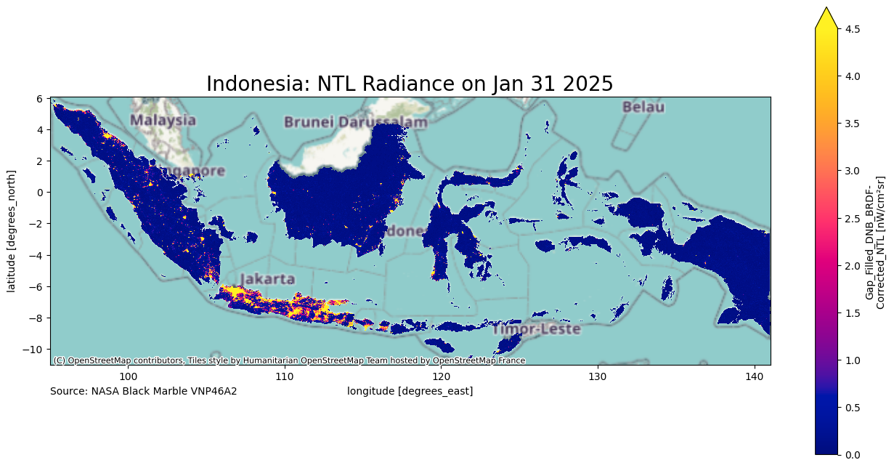{#fig-1}

@fig-1 The figure is a visualization of the yearly raster for nighttime lights in Indonesia in 2023. There is a stark contrast between the nighttime lights activity in Java compared to other islands, which is reflective of significant gaps in various socioeconomic indicators between Java and the rest of Indonesia. The stark difference in economic activity between Java and the rest of Indonesia is well-documented in literature, and is a consequence of the landscape and soil of the island facilitating stronger agricultural yields and population growth. 

Black Marble data can also be extracted for multiple time periods. The function will return a raster stack, where each raster band corresponds to a different date. The following code snippet provides examples of getting data across multiple days, for the month of May 2024 in Indonesia. We define a date range using pd.date_range.

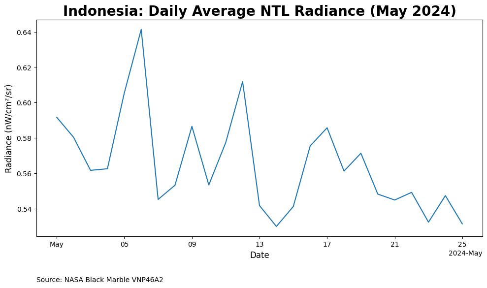{#fig-may}

Here we can see the fluctuations that exist within a given month, fluctuations that may be difficult to pinpoint from monthly or yearly rasters. One advantage of the flexibility of nighttime lights data is the ability to process it to suit the needs of any kind of time series analysis. In this instance, to facilitate the goal of making a proper comparison between nighttime lights and GDP, both series needed to be expressed on the same unit level. In Indonesia, GDP growth is typically reported in quarterly year-on-year terms. To align the nighttime lights data with this format, multiple steps were needed. First, monthly rasters were extracted from January 2012 to December 2024, covering the full period of available Black Marble nighttime lights data. The data was then saved as a .zip file. The radiance values were also extracted and saved as a separate .csv file.

With the radiance values extracted in a monthly form, the next steps involved transforming the data into quarterly year-on-year terms. Nighttime lights data was aggregated into quarterly terms. The data was then lagged and shifted 1 year back, from which the year-on-year change was able to be calculated. 

GDP growth data was straightforward to collect due to the data being readily available from the BPS website [@bps]. Quarterly GDP growth from consumption side and aggregate GDP growth was used for the purposes of this study. The GDP series includes data from Q1-2010 to Q2-2025, but we will use Q1-2012 as our starting point in line with the availability of nighttime lights data from NASA Black Marble.

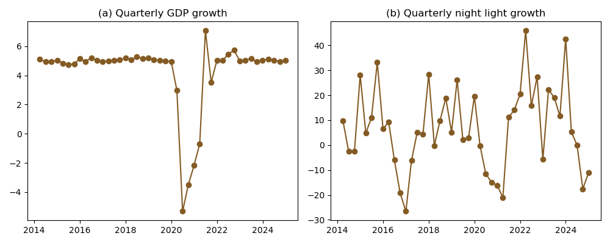{#fig-2}

@fig-2 shows our two main variables. The left panel is the GDP growth sourced from @bps while the right panel is the calculated night lights we gathered via Black Marble python package. Both seems to follow similar trend. The pearson correlation for the two vaariables is 0.44 which suggests a potential cointegration. However, night light index doesn't show significant drop during the COVID time, unlike the GDP growth.

Moreover, the volatility of the nighttime lights series could indicate that there is no stable mean and that variance is constantly changing. From the eye-test, it would appear that the series is non-stationary. GDP growth, on the other hand, appears mostly stable outside of a large structural break during the COVID period. This normally indicates the series is stationary, but the structural break could cause potential problems for formal models. An ADF test is needed to confirm the stationarity of both series. 

## Methodology

Unlike @nl and others, our dataset does not contain any cross-sectional variation. Therefore, techniques that utilise cross-sectional mean cannot be exploited. Multivariate time series techniques, thus, should be the appropriate method.

Given the nature of the data as multivariate time series, certain tests need to be performed before moving on to the modeling process [@enders;@ts]. First, we check stationarity using the ADF test to determine whether the two series are stationary at the same level. Growth data are usually stationary for level variables. If the series are truly stationary, Vector AutoRegression (VAR) would be the most appropriate model choice. However, the structural breaks experienced during COVID-19 could create potential problems due to shock and scarring effects. There is a possibility of  cointegration existing between the two series. In such a case, the Vector Error Correction Model (VECM) is the appropriate method to use. [@enders;@ts].

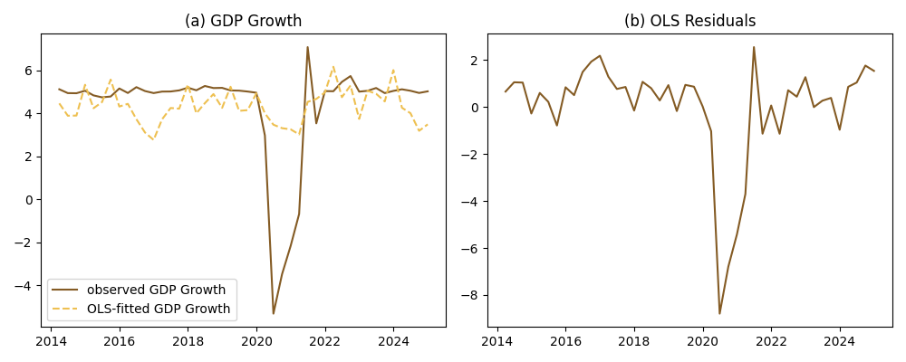{#fig-3}

@fig-3 shows the OLS fit and the residuals. We can see that the predictive from OLS doesn't fit well with the actual GDP growth. Moreover, the elasticity parameter from the estimation of 0.047 (see Appendix A for the table) is well below 0.26 as in @nl.

The ADF test shows that while the nighttime lights series is stationary, the GDP growth series is not. We cannot reject the null hypothesis of non-stationarity of the GDP growth series at the 5\% level. This is contrary to typical growth number, potentially amid covid. It is important to note that the p-value is pretty close to a rejection. This suggestst that a structural VAR model model may still suitable if we control for the COVID variable. Lastly, the potency that the two series integrate at a different level also warrants the use of ARDL [@ts;@enders].

We then proceed to the Johansen cointegration test. We first find a proper lag, then proceed to the Johansen cointegration test. The null hypothesis is there is no cointegration among variables used. The trace test statistic results are larger than the critical value, which suggest that we reject the null hypothesis. This would suggests a VECM as a method of choice. However, the null hypothesis of the number of rank equals two is also rejected. This suggests a potentially feasible two cointegration equations. An equal number between the cointegration equations and the endogeneous variables mean the VECM may perform no different than VAR.

The ADF test and the Johanse cointegration test are not terribly conclusive, we proceed with testing three potential multivariate time series technique, namely VAR, ARDL and VECM. To sum up:

- VECM reasons: Both are not integrated at the same level, OLS-residuals is stationary, Johansen Cointegration failed to reject $H_0$.

- VAR reasons: Economic growth is _almost_ stationary (p-value is very close to the critical level), Johansen Cointegration failed to reject a possibility of only 1 cointegration coefficient.

- ARDL reason: Economic growth $I(1)$ while the night light growth is $I(0)$. Additionally, ARDL allows for one endogeneous variable[^1].

For robustness, we also try to do the time series on the log quarterly GDP and night light instead of growth.

## Economic growth estimations

We ran various specifications, including dummy quarterly, dummy COVID (2020-2022), and dummy scarring (2020 onwards). Additionally, we also tried various lag specifications, including BIC-selected lags and HQ-selected lags.  In this paper, we show results from the no dummy and dummy scarring using AIC-selected lags amid the most consistent. We show all VECM, VAR and ARDL models. We also only show graph in this section because we concern mostly on fitting the model at this stage of reasearch. Regression table and full replication notebook can be access [here](nitelite3stata.html){target="_blank"}.

As discussed, this section presents graphs for the observed line and the predicted line of three different models: VECM, VAR and ARDL. Each model have six specifications. Panel (a) shows only the two variables, quarterly economic growth and quarterly night light index growth. Panel (b) adds a dummy covid, while panel (c) adds a dummy scarring. The next three panels repeat with quarter dummies added.

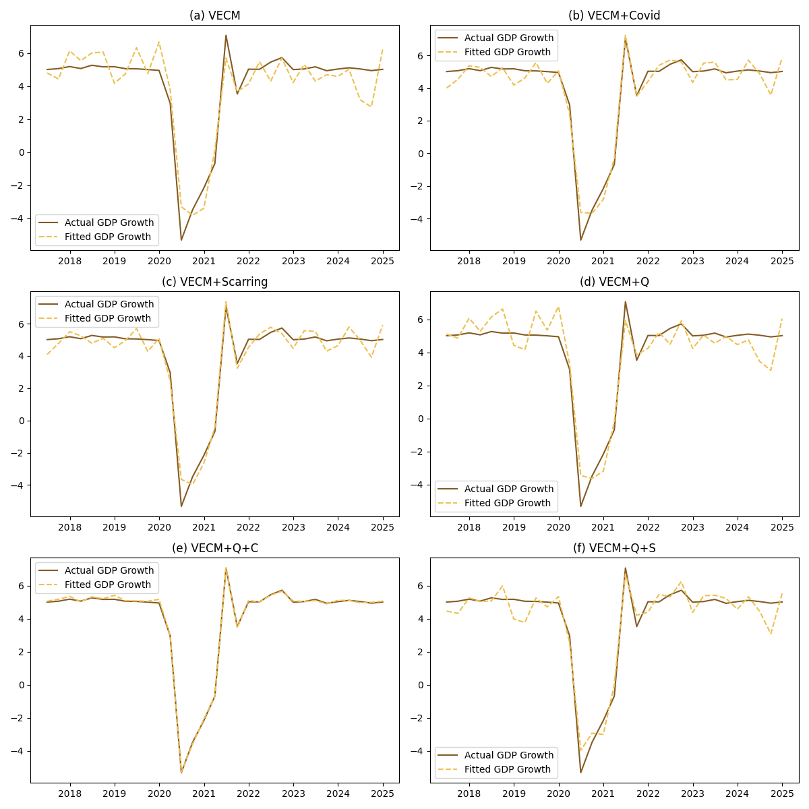{#fig-4}

@fig-4 shows the VECM approach. First thing to notice is how volatile the predictive GDP compared to the actual GDP growth. From the 6 figures, the VECM with COVId and quarterly dummy seems to perform the best. We show the specification of this particular model in the notebook in the appendix. The model uses 12 lagsof both night light and GDP growth. Interestingly, all night light variables show a negative coefficient, with positive error correction term. This is contrary to the well-behaved equation according to the theory. Adding to the fact that we have two cointegration rank, it is safe to say that the VECM isn't the proper method to model these two series.

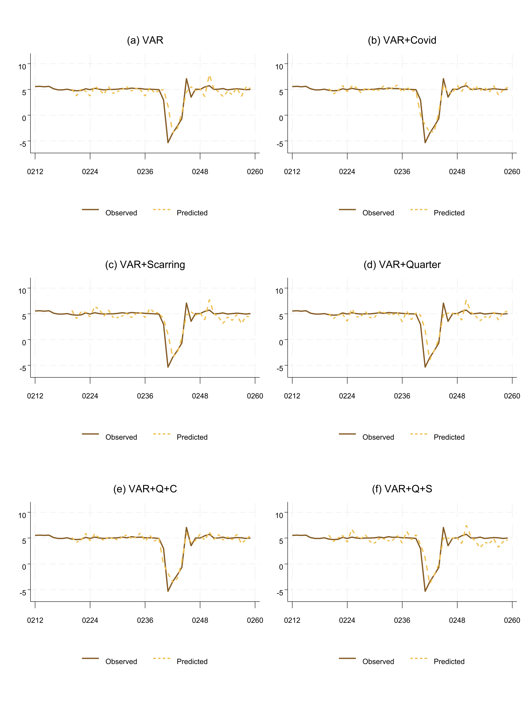{#fig-5}

Cointegration with two ranks suggest VAR model may be more appropriate, which results are presented in @fig-5. Again, models with COVID dummy (panel (b) and panel (e)) show better results compared to others. Eight lags are used in this equation. Only lag 4 of the night light variable is significant at 10% level.

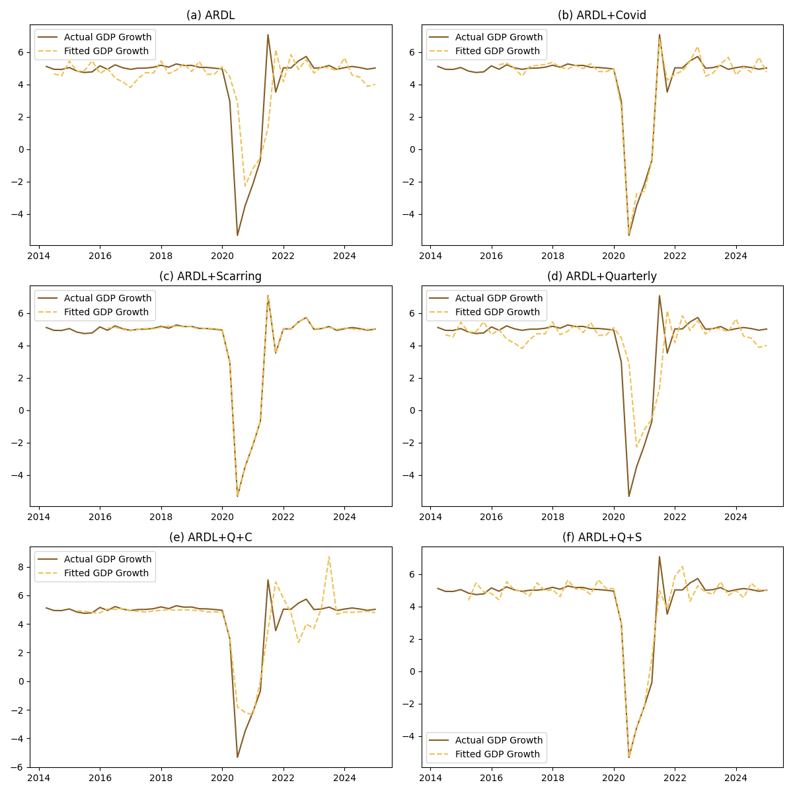{#fig-6}

Lastly, @fig-6 shows the ARDL approach. This time, we see the panel (c) as the best performing one, the one with scarring dummy and no quarterly dummy. The panel (c) uses $ARDL(p,q,r)=ARDL(7,8,5)$ specification where $p,q,r$ and lags for GDP growth, night light growth and scarring dummy respectively. Again, we find the night light to be a bad predictor, where only lag 6 is significant at 10% level. However, this equation seems to be the better performing one so far.

Looking at unsatisfactory performance of the night light indicator, we move on to try to use quarterly-level data instead of growth. As discussed, we omit VAR amid non-stationarity.

## Quarterly real GDP regression

This section uses log quarterly real GDP and log quarterly night light index instead. We run this regression for robustness check. The possibility of a less volatile night light index progression may improve our estimation for the real GDP. It also quite common in macroeconometric literatures to regress level equations instead of growth [@enders].

This section follows the same procedure as previously. We first show the dataset for both series, then run an OLS regression to check if the residuals are stationary. Johansen Cointegration test is also applied, and we try both VECM and ARDL to the two series. VAR is not used in this case since the two series are not stationary at level.

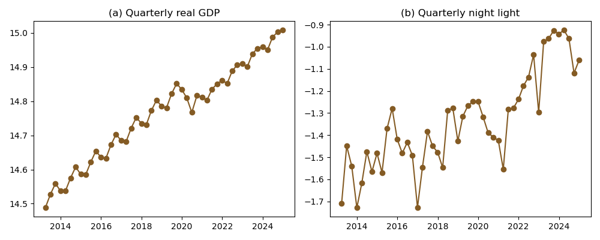{#fig-7}

@fig-7 shows the log quarterly real GDP and log quarterly night light index side by side. We can see clear positive trends on both series, which surely denies stationarity. We run ADF test (see Appendix A) to confirm this. We run OLS regression to the two series as well to check the parameter of the night light indicator (which is 0.52, see Appendix A) as well as its residuals.

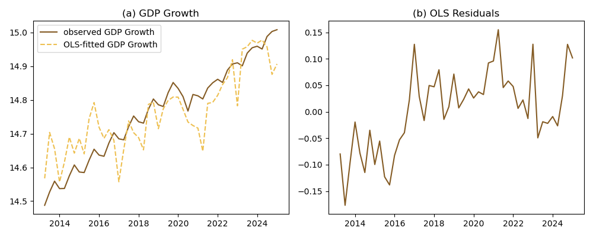{#fig-8}

@fig-8 shows the OLS-fit and residuals. Again, OLS seems to be a bad fit for the two series. More importantly, we can see a clear bias in how the predicted growth progresses. That is, the model overpredict GDP pre-2017 and underpredict GDP post 2017. We can see in the residuals as well. What happens in 2017?

ADF test confirms that the error term is stationary and Johansen Cointegration test is indeed confirms the rejection at rank at most 1, and failed to reject the $H_0$ of at most 2 rank of cointegration. This means VECM seems to be a good approach this time.

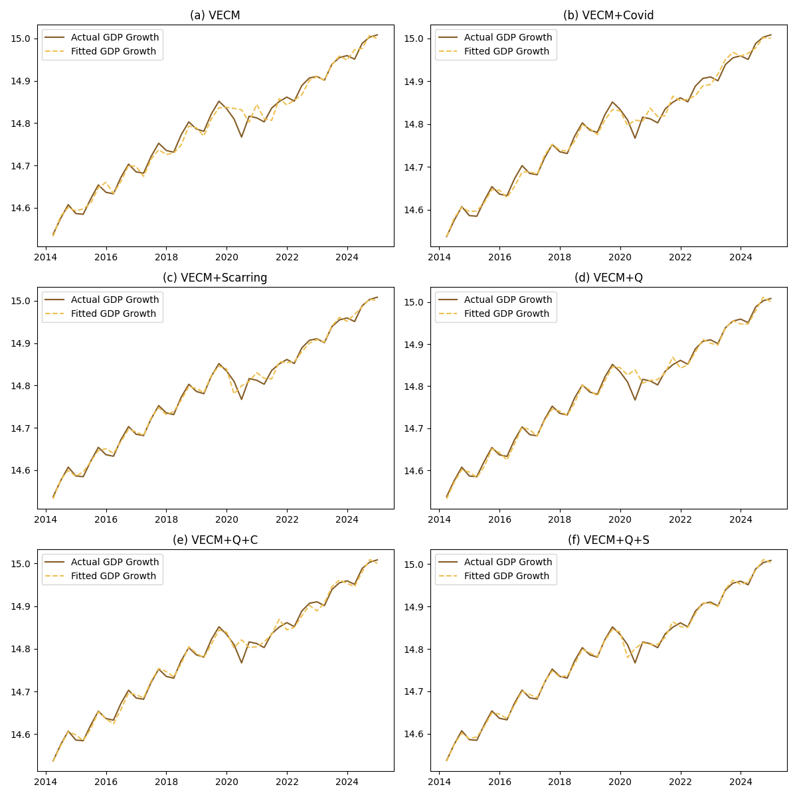{#fig-9}

We proceed with the VECM which results can be observed in @fig-9. Arguably, panel (f) with scarring and quarter dummy perform the best. Panel (f) uses 3 lags, but none of the night light parameters are significant. We do however have a negative error correction term, so a cointegration is confirmed. While panel (f) shows a promising model, it still fail to show the importance of night light index to forecast GDP.

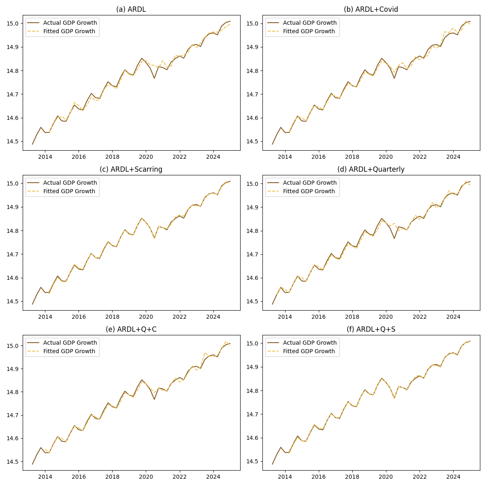{#fig-10}

Lastly, @fig-10 shows our ARDL results. Models with scarring perform relatively well. Panel(f), for instance, uses 0 lag for night light, with parameter of $0.0128$ and significant at 5% level. So far, this seems to be the best performing model.

## Conclusion

This paper shows three different macroeconometrics model runs at 6 different specification each, with the goal of finding whether Indonesian night light index can be used to estimate quarterly GDP growth. We find no satisfactory model for growth, with no night light index show positive and significant impact on the GDP. A promising candidate so far is the ARDL with scarring effect for log quarterly data, which shows that night light coefficient to be positive and significant. Unfortunately at this stage we cannot test for 2025 because the 2025 night light data is not available yet from `blackmarblepy` at the time of this writing.

The next step is for us to split the observation into train and test data. We are also still trying to collect data for provincial night light so we can have a cross-sectional variation. We also occassionally try other method. Any comments and criticisms to improve the paper is welcomed.

## References {.unnumbered}

::: {#refs}
:::

## Appendix {.supplementary}

## Appendix A {.unnumbered}

See [imedkrisna.github.io/nitelite/appendix.html](appendix.html){target="_blank"}

[^1]: As discussed above, previous papers use cross-sectional regression which presents no lag. Night light is also more immune from administrative error and other kinds of potential biases.