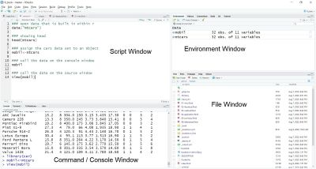

# Starting with R

🚧 Under Construction 🚧

Now that you have R and RStudio installed, let's start playing around with it. It is easy to be scared with command-type type of language, but do not worry. The first step is always the hardest. You will get there in no time at all.

One thing to note is that you will never have to use R GUI. Just keep RStudio's shortcut in your desktop and everything will be allright.

Now let's get to RStudio

## RStudio's interface
First, familiarise yourself with RStudio interface. RStudio looks like this:
```{r echo=FALSE, fig.cap="RStudio's interface"}

```
As you can see from the above figure, RStudio have four main windows.

### console window
Arguably the most important window in RStudio. We write R command in this window.

### script window
Forget what we said about the previous window. This is the most important window in RStudio. We write our sets of command in this window

### environment window
You can observe your environment here, such as the data and variables / series you created. This window also have other useful tab such as "history" which can show you the history of what happens in your environment, but we will skip them for now.

### files window
Although we call it 'files window', this window consists of 5 tabs. The tab file shows your working directory. When you run a code that generates file such as graphics, it will be stored in this window. Plots tab shows you your latest plot.

Packages tab show you all the package that you have. You can also add new package from this tab instead of using the `install.packages()` command. In this tab, you can also activate package that you have instead of using `library()` command.

"help" tab will show you some information about things that you ask help for when you use `?'command'` command. Will show you how it works in a minute.

Lastly, "viewer" tab. I actually forgot why it exists so whatever.

## using your console window
Generally, you type commands and operators such as `print()` and `1+1` and the likes on the console window. Let's try it a bit.

If you type 1+1 in the console and hit enter, you will get:

```{r}
1+1
```
you can print your name in r
```{r}
print('Hello world! My name is Jane Doe')
```
In short, chunks of code we use in this book is meant to be typed on your console window.

## using R script
However, to be a good coder, you will, most likely, store your chunks of code on the R script.

## package

## Update
You need to keep your R, RStudio and your installed packages updated as much as you can. Here's how to do it using the console window.

Firstly, install a package called `installr` by typing `install.packages('installr')` in your console window. Don't forget to hit enter. You only need to do this once. Next, call it using `library(installr)`. Calling the package will be needed to be done everytime you start a new R session (i.e., everytime you open R).

After you called it with `library()`, type `updateR()` on your console, and let it do its magic.

To keep your packages updated, you only need to click "tools" on the toolbar up there, then "Check for Packages Updates...". Depending on how much packages you have installed on your machine, can take a while.

Keep in mind that you need to stay connected to the internet when you update your R, RStudio and packages.

