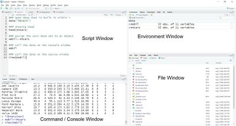

--- 
title: "Modul Praktikum Statistika dengan R"
author: "I Made Krisna Gupta"
date: "`r Sys.Date()`"
site: bookdown::bookdown_site
output: bookdown::gitbook
documentclass: book
bibliography: [book.bib, packages.bib]
biblio-style: apalike
link-citations: yes
github-repo: rstudio/bookdown-demo
description: "belum ada deskripsi"
---

# Pendahuluan

## Modul apa ini?
Modul ini merupakan panduan mahasiswa dalam mengaplikasikan teori tentang statistika dan analisis data ke dalam standar praktik di dunia usaha. Khususnya, modul ini bertujuan untuk membantu mahasiswa menggunakan R, sebuah bahasa pemrograman _open source_ yang banyak digunakan oleh analis data untuk menganalisis data menggunakan statistik, dan melakukan visualisasi data. Lebih lengkap tentang R dapat ditemukan di [https://www.r-project.org/](https://www.r-project.org/)

## Kenapa R?

Ada beberapa aplikasi yang dapat digunakan untuk menganalisis data, seperti Microsoft Excel, EViews, SPSS, dan lain sebagainya. Beberapa alasan mengapa modul ini ditulis dengan menggunakan R:

### Kebutuhan akan logika menulis kode
Beberapa aplikasi yang ada di pasaran saat ini seperti Microsoft Excel ataupun Google Sheet merupakan aplikasi yang cukup mudah dipelajari. Namun demikian, kebutuhan dunia usaha untuk tenaga kerja yang dapat menulis kode semakin meningkat. Menulis kode sendiri memiliki berbagai manfaat. Pertama, logika menulis kode akan mempermudah mahasiswa mempelajari bahasa lain yang lebih mendasar seperti Phyton. Bahasa-bahasa ini di masa depan dapat menjadi pilihan jika mahasiswa berniat meniti karir lebih khusus di dunia analisis data, di mana kebutuhan sumber daya manusia di sini masih sangat signifikan.

### R termasuk cukup mudah dipelajari
R adalah bahasa yang memang ditulis untuk digunakan dalam analisis statistik. R adalah pintu masuk yang cukup baik dari statistisi menuju kemampuan lain yang berhubungan dengan _coding_ seperti _text mining_ dan lain sebagainya.

Selain modul ini, ada sangat banyak sumber belajar di internet. R memiliki komunitas pengguna yang cukup luas dan beragam. Komunitas-komunitas ini tidak segan-segan berbagi dan menjawab pertanyaan anda. Beberapa permasalahan yang anda temui mungkin sudah dijawab orang lain, dan forum-forum seperti ini akan sangat membantu ketika sudah bekerja.

### Open Source
R adalah _open source_, dengan kata lain, _user_ dapat menggunakan R secara cuma-cuma (iya, gratis). 

## Alat dan bahan yang dibutuhkan
Untuk menjalankan program-program yang ada di modul ini, anda membutuhkan sebuah komputer atau laptop, lalu anda akan memerlukan aplikasi bernama R dan Rstudio. Modul ini mengasumsikan anda menggunakan sistem operasi windows, namun melakukan instalasi di sistem operasi non-windows juga tidak kalah mudahnya. Langkah-langkah berikut ini juga dapat dengan mudah anda temukan di berbagai situs.

Anda juga membutuhkan kuota internet.

### Menginstall R
R dapat didownload secara gratis di [https://cran.r-project.org/bin/windows/base/](https://cran.r-project.org/bin/windows/base/). Kemudian anda dapat mengetuk pada tulisan "Download R X.x.x for windows (xx megabytes, 32/64 bit)" untuk memulai mengunduh R. Anda akan memulai mengunduh file dengan ekstensi .exe. Setelah unduhan selesai, silakan ketuk dua kali pada file .exe tersebut, dan klik next terus sampai instalasi dimulai.

### Menginstall RStudio
Setelah R terinstall di komputer anda, silakan pergi ke [https://rstudio.com/products/rstudio/download/](https://rstudio.com/products/rstudio/download/) untuk mengunduh RStudio.Pilih RStudio Desktop yang free, lalu ketuk "DOWNLOAD RSTUDIO FOR WINDOWS" untuk memulai pengunduhan. Setelah file selesai diunduh, silakan ketuk dua kali, klik next terus sampai instalasi dimulai.

## Tampilan R
Setelah anda selesai menginstall RStudio, maka anda hanya perlu membuka RStudio dari desktop anda. Anda tidak perlu lagi membuka R. Karena itu, _shortcut_ RStudio lebih penting daripada _shortcut_ R.

RStudio memiliki tampilan utama berupa 4 jendela. Berikut adalah tampilan RStudio:

```{r echo=FALSE, fig.cap="Tampilan RStudio"}

```

Secara garis besar, RStudio Memiliki 4(empat) jendela, yaitu script, console, environment dan file. kode yang ada di buku ini harus anda ketik di jendela _'console'_, sementara script merupakan kumpulan kode.

Untuk saat ini, mengetahui nama-nama dari keempat jendela ini sudah cukup. Bagaimana menggunakannya akan diperjelas di bab-bab berikutnya.

## update R
R merupakan aplikasi yang cukup sering mendapatkan update. Karena itu, anda harus rajin-rajin ngecek update ketika menggunakannya. Jangan lupa juga bahwa anda akan memerlukan kuota internet untuk melakukan update.

Ada banyak cara untuk melakukan update terhadap R, tapi berikut ini akan disampaikan cara tercepat untuk melakukannya dengan menggunakan 'console' di RStudio.

pertama, instal paket bernama "installr":
```{r eval=FALSE}
install.packages("installr")
```

Instalasi paket ini hanya perlu dilakukan pertama kali anda menginstall R. setelah sekali diinstal, paket itu akan selalu ada di komputer anda. Setelah menginstal paket "installr", panggil paket tersebut dengan:

```{r eval=FALSE}
library(installr)
```

Fungsi library harus selalu dipanggil ketika akan menggunakan paket tersebut setiap kali anda memulai baru r. Setelah anda memanggil library tersebut, anda tinggal menggunakan fungsi "updateR()" pada console.

```{r eval=FALSE}
updateR()
```

Lalu di yes yes saja sampai update selesai.

<!--chapter:end:index.Rmd-->

# Introduction {#intro}

You can label chapter and section titles using `{#label}` after them, e.g., we can reference Chapter \@ref(intro). If you do not manually label them, there will be automatic labels anyway, e.g., Chapter \@ref(methods).

Figures and tables with captions will be placed in `figure` and `table` environments, respectively.

```{r nice-fig, fig.cap='Here is a nice figure!', out.width='80%', fig.asp=.75, fig.align='center'}
par(mar = c(4, 4, .1, .1))
plot(pressure, type = 'b', pch = 19)
```

Reference a figure by its code chunk label with the `fig:` prefix, e.g., see Figure \@ref(fig:nice-fig). Similarly, you can reference tables generated from `knitr::kable()`, e.g., see Table \@ref(tab:nice-tab).

```{r nice-tab, tidy=FALSE}
knitr::kable(
  head(iris, 20), caption = 'Here is a nice table!',
  booktabs = TRUE
)
```

You can write citations, too. For example, we are using the **bookdown** package [@R-bookdown] in this sample book, which was built on top of R Markdown and **knitr** [@xie2015].

<!--chapter:end:01-intro.Rmd-->

# Literature

Here is a review of existing methods.

<!--chapter:end:02-literature.Rmd-->

# Methods

We describe our methods in this chapter.

<!--chapter:end:03-method.Rmd-->

# Applications

Some _significant_ applications are demonstrated in this chapter.

## Example one

## Example two

<!--chapter:end:04-application.Rmd-->

# Final Words

We have finished a nice book.

<!--chapter:end:05-summary.Rmd-->

`r if (knitr:::is_html_output()) '
# References {-}
'`

<!--chapter:end:06-references.Rmd-->

