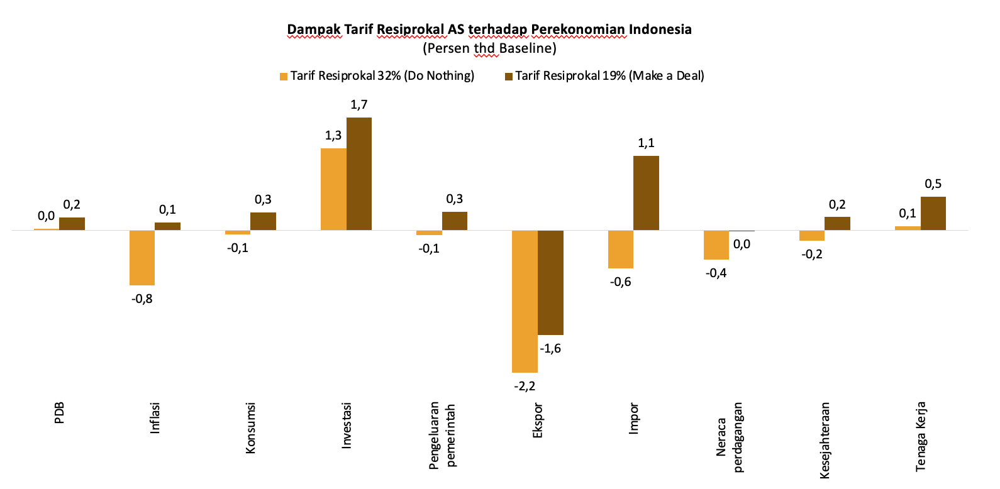

## Introduction


Pada 2 April 2025, Presiden Amerika Serikat Donald J. Trump mendeklarasikan “Liberation Day” setelah sebelumnya menandatangani memorandum terkait kebijakan perdagangan untuk menyelidiki defisit perdagangan AS dan praktik tidak adil mitra dagang AS. Presiden Trump menilai adanya ketimpangan tarif dan hambatan non tarif, serta kebijakan ekonomi sejumlah mitra dagang yang menekan tingkat upah dan konsumsi domestik telah berkontribusi pada defisit perdagangan tahunan yang besar dan berkelanjutan bagi Amerika Serikat. Hal ini dianggap oleh Presiden Trump suatu ancaman terhadap keamanan nasional dan stabilitas perekonomian nasional. 

Pada hari tersebut, Presiden Trump mengumumkan tarif dalam dua tingkat: tarif baseline sebesar 10% yang dikenakan pada impor dari semua negara yang tidak dikenai sanksi lain serta tarif tambahan setiap negara yang disebut tarif resiprokal yang berkisar antara 11% hingga 50% bagi negara-negara tertentu, termasuk terhadap negara-negara ASEAN seperti Vietnam (46%), Thailand (36%), Indonesia (32%), dikenakan tarif yang secara relatif lebih besar dibandingkan negara lainnya, seperti India (27%), Korea Selatan (26%), Jepang (24%), dan Uni Eropa (20%) [@wh].

Laporan ini bertujuan untuk menganalisis dampak kebijakan tarif resiprokal AS terhadap perekonomian Indonesia, termasuk dampaknya terhadap PDB, neraca perdagangan, ekspor, impor, inflasi, kesejahteraan, dan ketenagakerjaan. paper ini diharapkan memberikan sumbangan terhadap literatur perdagangan internasional kontemporer melalui penyajian analisis dalam kerangka multi-negara. Selain itu, makalah ini turut memperkaya literatur mengenai tarif resiprokal dengan menunjukkan adanya pola dampak yang serupa sebagaimana teridentifikasi dalam isu tersebut.

Simulasi dilakukan dengan model standar GTAP versi 7 [@model] dan GTAP database versi 11 [@database]. Tidak ada modifikasi pada model maupun database yang dilakukan di dalam simulasi ini.

## Dinamika Tarif Resiprokal AS

Terdapat beberapa tahap perubahan besaran tarif resiprokal AS terhadap berbagai negara, termasuk Indonesia. Saat pengumuman tarif tahap 1 pada 2 April 2025, AS mengenakan tarif resiprokal 32% terhadap seluruh barang Indonesia. Pemerintah merespon cepat atas pengenaan tarif yang relatif tinggi tersebut dan melakukan negosiasi melalui beberapa penawaran seperti penghapusan sebagian atau seluruh barang AS, penghapusan NTB (Non-Tariff Barriers), dan juga rencana peningkatan investasi ke AS.

Hal ini menghasilkan kesepakatan bahwa AS akan menurunkan besaran tarif resiprokalnya terhadap Indonesia menjadi 19% atau yang terendah diantara negara ASEAN lainnya sebelum akhirnya AS pun menurunkan tarif resiprokalnya terhadap negara-negara lainnya, termasuk Vietnam menjadi 20% dan Cambodia, Thailand, Malaysia, Philippines menjadi 19% pada 31 Juli 2025. Selain itu, beberapa negara/kawasan lainnya juga mendapatkan tarif lebih rendah dibandingkan Indonesia seperti Korea Selatan, Jepang, dan Uni Eropa, yakni sebesar 15%.

```{r}
#| warning: false
#| message: false
#| echo: false
#| label: tbl-tarif
#| tbl-cap: "Dinamika tarif resiprokal AS terhadap berbagai negara"

library(tidyverse)
library(kableExtra)
library(readxl)

t1<-read_excel("Data policy paper tarif.xlsx", sheet = "tarif")

t1 |>
  kable(digits=2)
```


Pada 27 Agustus 2025, AS kembali menaikan tarif resiprokal pada India menjadi 50% meskipun sebelumnya AS memotong 1% poin tarif resiprokalnya terhadap India. Kebijakan ini diklaim sebagai hukuman terhadap India atas pembelian minyak dan senjata dari Rusia yang dinilai membantu mendanai perangnya dengan Ukraina. 

## Perdagangan Bilateral Indonesia – Amerika Serikat 

Amerika Serikat merupakan salah satu mitra dagang penting bagi Indonesia yang. Pada tahun 2024, AS menjadi negara penyumbang surplus neraca perdagangan terbesar, yaitu sebesar USD14,4 miliar. Pangsa pasar AS bagi ekspor Indonesia sebesar USD26,4 miliar atau 10,6% total ekspor nasional, menjadi yang terbesar kedua setelah China yang memiliki pangsa USD60,2 miliar atau 24,2%. Selain itu, komoditas ekspor Indonesia ke AS mayoritas merupakan sektor padat karya dengan AS sebagai negara tujuan utama ekspor seperti komoditas tekstil dan produk tekstil (55,4%), alas kaki (33,8%), furnitur (59,1%), dan komoditas perikanan dan udang (35,0%). 

Tarif resiprokal 32% berpotensi menurunkan daya saing ekspor Indonesia secara signifikan, terutama jika negara kompetitor memiliki tarif yang jauh lebih rendah. Hal ini dapat terlihat pada sektor udang dan perikanan, di mana ekuador menjadi kompetitor Indonesia yang kuat dengan volume produksi yang tinggi, beban tarif yang lebih rendah (10%), dan jarak geografis yang lebih dekat ke AS. 

Penurunan tarif AS terhadap Indonesia dari 32% menjadi 19% dapat terlihat dari posisi Indonesia yang menjadi lebih kompetitif dibandingkan dengan tarif yang diumumkan pada Presiden Trump pada 2 April 2025. Jika dilihat dari produk-produk ekspor utama Indonesia ke AS, seperti alas kaki, pakaian dan aksesoris pakaian, lemak dan minyak hewan/nabati, karet, serta olahan daging dan ikan, Indonesia menempati peringkat dengan tarif yang relatif lebih rendah dibandingkan negara-negara kompetitor lainnya, termasuk Vietnam, Bangladesh, dan India. 

Di sisi lain, Indonesia mengimpor USD12,0 miliar barang dari AS atau 5,1% dari total impor nasional 2024 dan menjadi terbesar ke-4 setelah China (31,1%), Singapura (9,2%), dan Jepang (6,4%). Adapun komoditas impor utama indonesia dari AS adalah bahan bakar mineral & minyak bumi (24,4%), mesin & peralatan mekanik (12,6%), minyak biji-bijian & hasil pertanian (10,5%), limbah industri makanan & pakan ternak (5,4%), dan mesin listrik & peralatan elektronik (4,1%). 

## Metode

### GTAP Model

GTAP versi 7 merupakan sebuah model riil dengna multi-sektor dan multi-regional. Setiap negara terdiri dari 1 rumah tangga representatif yang melakukan konsumsi privat (_private consumption, C_), menabung (sehingga memberi suplai permodalan), dan faktor produksi (tenaga kerja, tepatnya). Tabungan tersebut dipool ke dalam sebuah bank yang kemudian mendistribusikannya ke berbagai sektor.

Setiap negara memiliki berbagai sektor yang diwakili 1 perusahaan yang mengambil tenaga kerja dan investasi dari rumah tangga dan bank. Setiap sektor juga mengambil input dari sektor lain.

Rumah tangga dan industri membeli barang dan jasa dari sektor industri domestik maupun impor. Produk domestik dan impor dapat saling menggantikan dengan sebuah elastisitas bernama elastisitas Armington. Pendekatan ini adalah pendekatan standar dalam analisis perdagangan internasional.

### Closure dan shock

Simulasi ini menggunakan _unemployment closure_ di mana kami melakukan _swap_ antara real wage labor supply, yang seringkali disebut juga sebagai _sticky wage closure_. _sticky wage_ berarti upahnya tidak bergerak. Ada perpindahan pekerja antar-sektor, tapi total employment berubah (bisa berkurang, bisa bertambah). Pada kenyataannya, upah mungkin saja tidak sepenuhnya sticky.

Semua simulasi tersebut dilakukan dengan situasi di mana Vietnam terkena tarif 20% dan memberikan konsesi 0% untuk AS. Semua simulasi ketika Indonesia terkena 19% tarif AS juga disertai dengan tarif 0% dari AS ke Indonesia.

## Hasil umum

Beberapa hasil simulasi yang disampaikan di sini adalah hasil makro dan hasil sektoral.

{#fig-1}

Hasil makroekonmi dapat dilihat pada @fig-1. Hasil GTAP menunjukan bahwa melakukan negosiasi perdagangan dan mendapatkan tarif resiprokal yang lebih rendah akan berdampak positif bagi perekonomian Indonesia. Hal ini dapat dilihat dari beberapa indikator kunci perekonomian seperti PDB, inflasi, konsumsi masyarakat, investasi, pengeluaran pemerintah, ekspor impor, neraca perdagangan, kesejahteraan, maupun ketenagakerjaan. 


Turunnya tarif resiprokal terhadap Indonesia menjadi 19% akan meningkatkan perubahan PDB nasional sebesar 0,2%, berbeda dengan ketika Indonesia dikenakan tarif resiprokal 32% yang relatif tidak berdampak pada pertumbuhan PDB. Perubahan ini utamanya ditopang oleh dampak peningkatan konsumsi (0,3%), investasi (1,7%), pengeluaran pemerintah (0,3%), dan net ekspor (0,0%) yang lebih tinggi jika dibandingkan dampak yang dihasilkan dari dikenakannya tarif resiprokal 32%. 

Investasi menjadi komponen dengan perubahan positif tertinggi dibandingkan dengan Indikator lainnya. Peningkatan investasi utamanya akibat beralihnya investasi negara lain yang memiliki tarif resiprokal lebih tinggi dibanding yang dikenakan terhadap Indonesia, khususnya di sektor yang memiliki ekspor pasar utama di AS. Beberapa contoh negara tersebut adalah China (55%), India (50%), Laos (40%), dan Bangladesh (20%). 

Perubahan tarif resiprokal juga berdampak pada membaliknya perubahan tingkat inflasi dan kesejahteraan nasional menjadi positif. Perubahan inflasi dan kesejahteraan meningkat akibat perekonomian yang ekspansif seiring dengan meningkatnya investasi dan produksi nasional. Sementara itu, tenaga kerja naik lebih signifikan akibat tumbuhnya industri nasional, khususnya di sektor industri padat tenaga kerja.

```{r}
#| warning: false
#| message: false
#| echo: false
#| label: tbl-sektor
#| tbl-cap: "Dampak tarif resiprokal terhadap sektor industri di Indonesia"

t2<-read_excel("Data policy paper tarif.xlsx", sheet = "industri")
t2 |>
  kable(digits=2)
```

Hasil dari sektor industri dapat dilihat pada @tbl-sektor. Penurunan tarif resiprokal menjadi 19% berdampak positif terhadap mayoritas industri yang berorientasi pada ekspor dengan pangsa pasar utama AS. Industri produk kulit dan industri pakaian merupakan industri yang paling diuntungkan akibat perubahan tarif resiprokal. Dampak pada industri produk kulit berbalik menjadi +5,05% saat tarif resiprokal 19% dari dampak -4,81% saat tarif resiprokal 32%, sementara dampak pada industri pakaian meningkat menjadi +4,6% dari yang sebelumnya -10,55%. Perubahan positif ini terjadi akibat beralihnya beberapa produksi industri tersebut dari negara yang terkena tarif resiprokal di atas 19% ke Indonesia. 

Perubahan ini cukup sensitif terhadap hasil dari simulasi. Ketika Brazil dan India terkena 50% tarif, hasil simulasi Indonesia 32% untuk Indonesia masih memberikan nilai PDB yang tidak berubah, dibandingkan ketika negara-negara tersebut terkena tarif yang rendah. 

Tarif resiprokal yang dikeluarkan oleh Presiden Amerika Serikat Donald Trump memberikan guncangan yang cukup besar baik untuk pemerintah negara lain maupun pelaku bisnis. Tidak hanya tinggi levelnya, tarif tersebut juga terus mengalami perubahan. Publikasi ini bertujuan untuk memberikan gambaran mengenai kemungkinan dampaknya pada ekonomi Indonesia. Berdasarkan temuan di publikasi ini, besaran tarif 19% akan memberikan dampak yang lebih baik ketimbang tarif 32%. Di samping itu, besaran tarif Indonesia harus diusahakan untuk selalu lebih rendah ketimbang negara lain. Karena itu, Indonesia perlu senantiasa aktif bernegosiasi sembari memantau tarif yang diberikan AS kepada mitra dagangnya yang lain. 

Fakta bahwa tarif yang dikenakan oleh Presiden Donald Trump terus mengalami perubahan harus menjadi pertimbangan bagi tim negosiator. Akan sulit untuk bernegosiasi apabila kesepakatan yang telah dicapai bisa dengan mudah diamandemen secara sepihak oleh Amerika Serikat. Negosiator sebaiknya meminta klausul yang melindungi Indonesia dari perubahan nilai tarif ataupun hambatan dagang lainnya yang dikeluarkan secara sepihak oleh AS. 

## Keterbatasan

Untuk menerjemahkan hasil simulasi di GTAP, seorang analis harus mempertimbangkan desain dari model ini. Asumsi "ceteris paribus" harus ditekankan karena setiap negara pasti akan memberikan reaksi terhadap potensi _outcome_ dari sebuah _shock_. Ada beberapa hal yang perlu diperhatikan:

1. **Free flow of labor and capital**. Model GTAP yang standar mempertimbangkan bahwa setiap pekerja dan kapital dapat "pindah industri" dengan mudah. Akibatnya, semua pekerja dan kapital memiliki return yang sama. Alias, hanya ada 1 upah dan 1 interest rate yang sama untuk semua industri di dalam suatu negara. Pada kenyataannya, proses adjustment ini tidak terjadi serta merta (butuh waktu), bahkan mungkin untuk faktor produksi yang sangat spesifik, perpindahan tersebut tidak dapat terjadi sama sekali.

2. **Zero trade cost** mengakibatkan dampak tarif yang relatif mirip meskipun negaranya letaknya cukup jauh. Misalnya, hubungan dagang Kanada dengan negara lain meningkat cukup pesat, termasuk dengan Indonesia. Karena itu hasil perubahan besar Indonesia-Kanada (dan dengan negara-negara lain juga) perlu dilihat dengan hati-hati. Meski demikian, hal ini tidak berarti tidak mungkin juga. Apalagi Kanada juga sedang menjajaki CEPA dengan Indonesia.

3. **Lack of monetary module**. GTAP adalah model riil yang tidak mempertimbangkan adanya pasar moneter. Artinya, tidak ada nilai tukar di model GTAP. Sebenarnya nilai tukar dapat di-*proxy* dengan _terms of trade_. Akan tetapi, yang terpenting adalah tidak adanya mekanisme eksogen untuk mengatur pasar uang. Tidak ada bank sentral di model ini yang dapat melakukan _quantitative easing_ atau _intervensi interest rate_ dan menciptakan surat utang. Hal ini penting karena kebijakan moneter akan mengubah alur barang dan jasa lewat nilai tukar dan neraca finansial. Akan tetapi yang lebih penting adalah karena saat ini dunia sedang berada di tengah ketidakseimbangan neraca finansial akibat dolar yang tidak hanya mendominasi, namun juga dikontrol oleh 1 institusi saja. (not a free market)

4. **Bebas dari reaksi pengambil kebijakan**: Model GTAP adalah model yang dibuat dengan struktur tertentu yang perlu dibaca dalam konteks. Model ini dijalankan dengan asumsi ceteris paribus, yang artinya diasumsikan bahwa negara-negara di model ini tidak menambahkan kebijakan apapun yang berpotensi mengubah arah perputaran ekonomi (misalnya subsidi, hambatan perdagangan tambahan, ataupun kebijakan industrial lain). 

Mengingat setidaknya empat keterbatasan di atas, laporan ini harus dibaca dengan hati-hati. Laporan ini saja tidak dapat dijadikan satu-satunya rujukan ataupun patokan dalam mengambil kebijakan. Diperlukan beberapa penyesuaian dan tambahan studi baik lapangan maupun empiris yang lebih kontekstual untuk kasus-kasus tertentu.

Laporan ini masih berupa dokumen berjalan dan akan diperbarui seiring dengan perkembangan situasi. Kritik dan saran sangat kami harapkan untuk perbaikan laporan ini di masa mendatang.

## Referensi {.unnumbered}